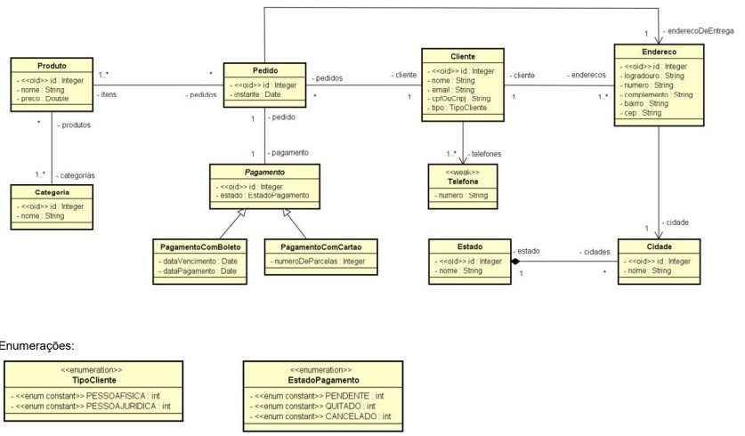

# ecommerce_api

This case study aims to show in practice how a conceptual model can be implemented on the object-oriented paradigm, using market standards and good practices

Tags: JAVA, SpringBoot, API REST, Web, Hexagonal Architecture

