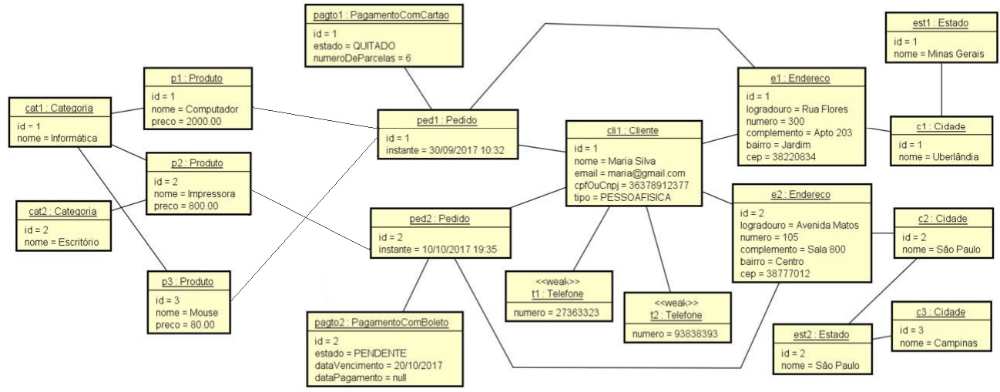

# Ecommerce Api

<b>Description:</b> This case study aims to show in practice how a conceptual model can be implemented on the object-oriented paradigm, using market standards and good practices

<b>Tags:</b> JAVA 17, SpringBoot, API REST, Web, Relational Database, PostGreSql, Hexagonal Architecture, @ManyToMany, @OneToMany, @OneToOne, herance

## Challenge 1

Make a default implementation of the following conceptual model:

## Challenge 2

Create the following conceptual model instances:

## Challenge 3

Generate a relational database automatically from the conceptual model, as well as populate the database with the given instance

## Challenge 4

Retrieve the data and make it available through a BASIC Rest API. The following end points must be available:

